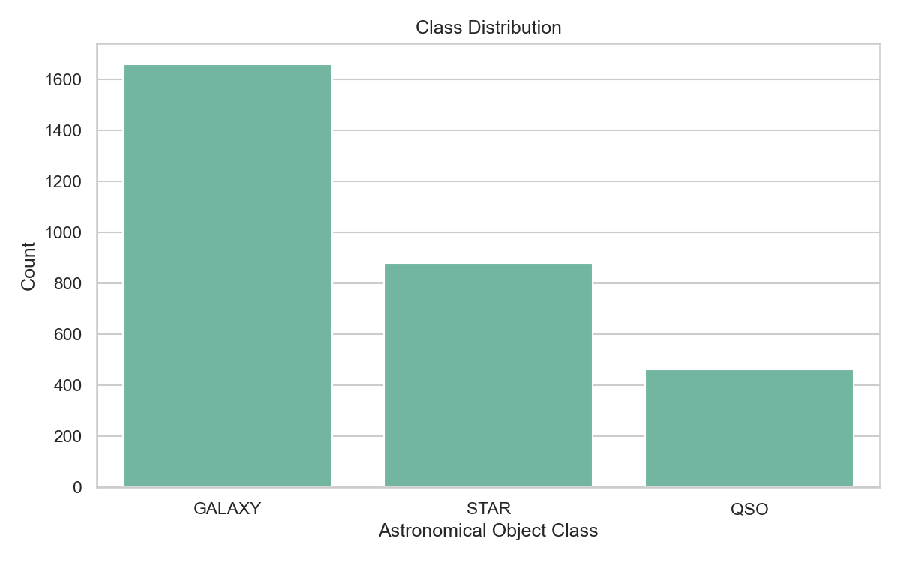
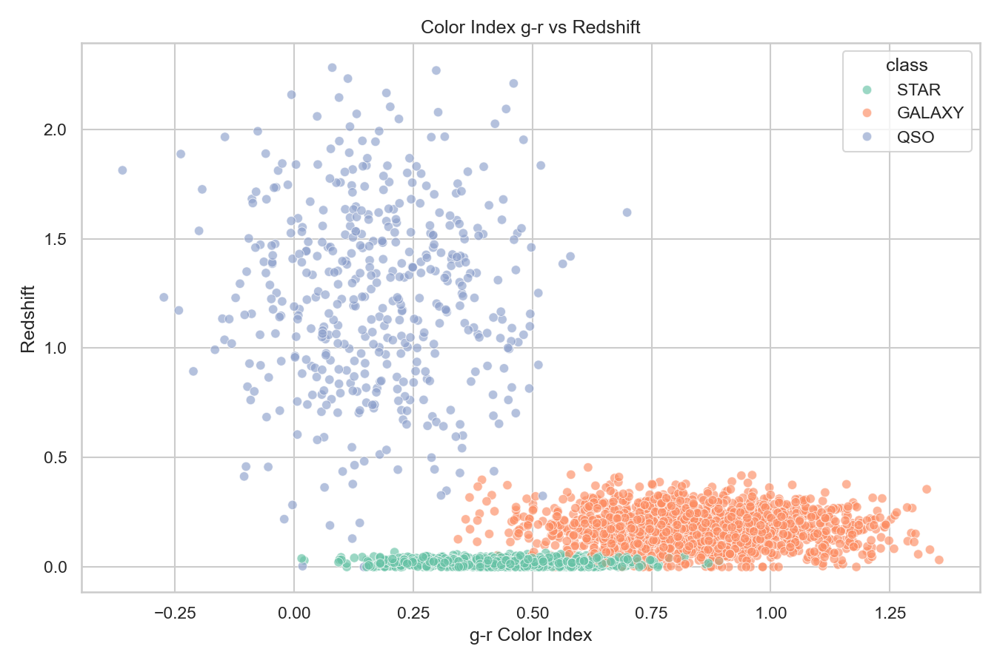
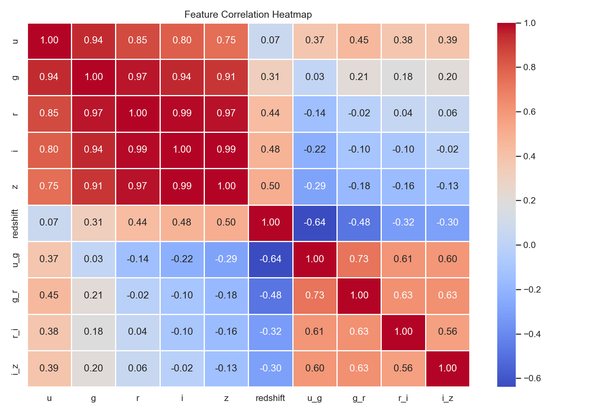
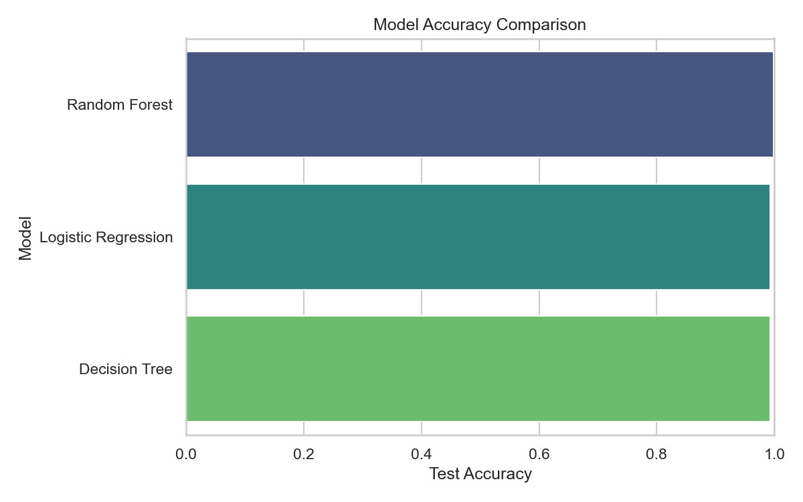
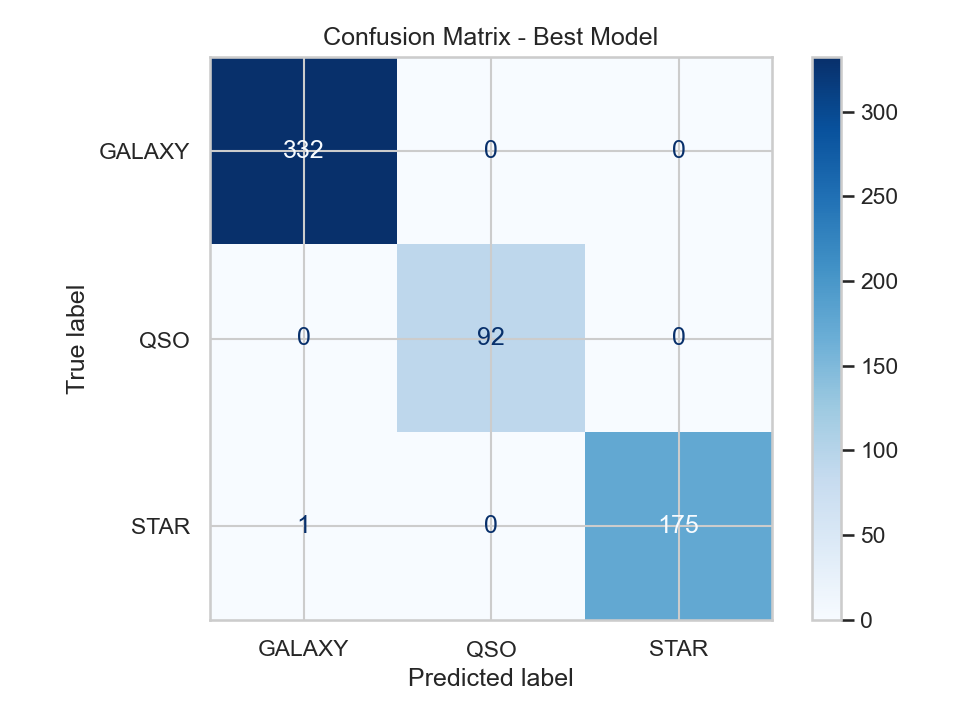
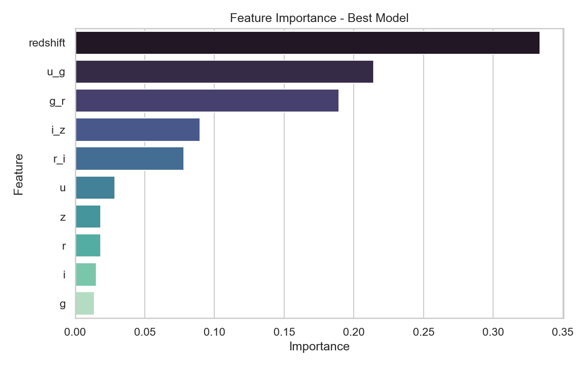

# Galaxy Classification using SDSS Dataset

This is a machine learning project for classifying astronomical objects using SDSS-like data. The model predicts whether an object is a `GALAXY`, `STAR`, or `QSO` based on photometric values and redshift.

## Overview

The Sloan Digital Sky Survey (SDSS) collects data about objects in space using different photometric filters. In this project, I used features like `u`, `g`, `r`, `i`, `z`, and `redshift` to train classification models.

The project includes basic data cleaning, EDA, feature engineering, model training, model comparison, and visualizations.

## Problem Statement

The aim of this project is to classify celestial objects into three classes:

- `GALAXY`
- `STAR`
- `QSO`

Different objects have different brightness patterns across filters. Machine learning can use these patterns to separate the classes.

## Dataset

The project uses an SDSS-like dataset with the following columns:

| Column | Description |
|---|---|
| `u` | Magnitude value in the u filter |
| `g` | Magnitude value in the g filter |
| `r` | Magnitude value in the r filter |
| `i` | Magnitude value in the i filter |
| `z` | Magnitude value in the z filter |
| `redshift` | Redshift value of the object |
| `class` | Target class |

Some extra color index features are created from the magnitude columns:

- `u_g`
- `g_r`
- `r_i`
- `i_z`

If `data/sdss_galaxy_data.csv` is not present, the script generates a small SDSS-like dataset so the project can be run directly.

## Tech Stack

- Python
- Pandas
- NumPy
- Matplotlib
- Seaborn
- Scikit-learn
- Joblib

## Project Structure

```text
galaxy-classification/
├── data/
│   └── README.md
├── notebooks/
│   └── galaxy_classification_eda.ipynb
├── src/
│   ├── __init__.py
│   └── train.py
├── models/
├── images/
├── README.md
├── requirements.txt
├── .gitignore
└── run.sh
```

## Installation

```bash
cd galaxy-classification
python3 -m venv .venv
source .venv/bin/activate
pip install -r requirements.txt
```

## How to Run

Run the complete training script:

```bash
bash run.sh
```

Or run it directly with Python:

```bash
python src/train.py
```

The script trains these models:

- Logistic Regression
- Decision Tree
- Random Forest

## Results

Accuracy from the latest run:

| Model | Test Accuracy |
|---|---:|
| Logistic Regression | 0.9933 |
| Decision Tree | 0.9933 |
| Random Forest | 0.9983 |

Random Forest gave the best accuracy on this dataset.

The trained model and result files are saved inside the `models/` folder. The plots are saved inside the `images/` folder.

## Sample Output / Visualizations

### Class Distribution



### Color Index vs Redshift



### Correlation Heatmap



### Model Accuracy Comparison



### Confusion Matrix



### Feature Importance


